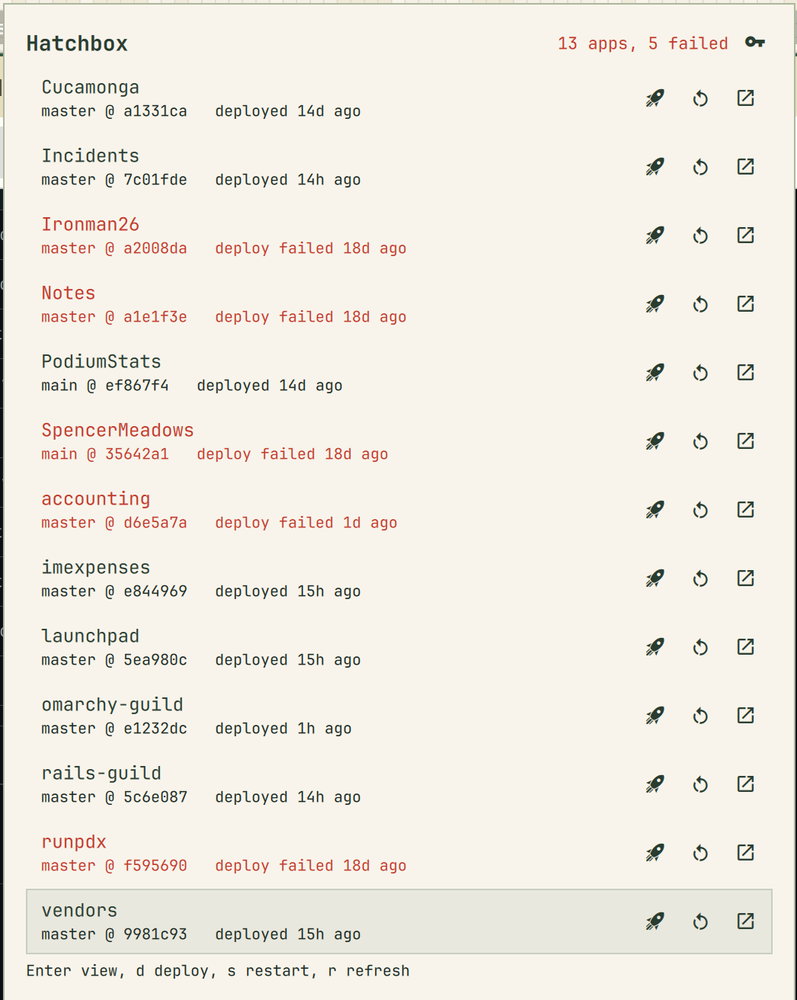
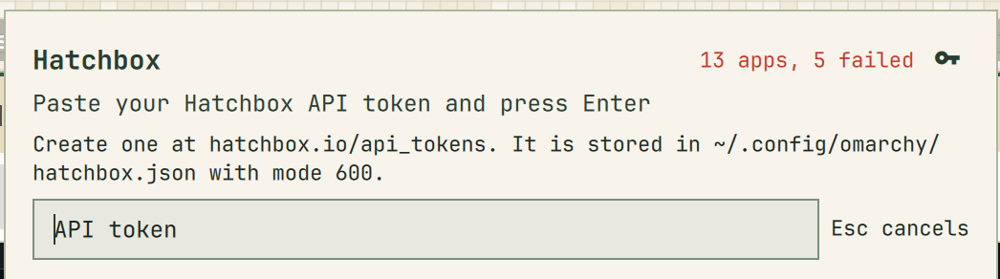

# Hatchbox for Omarchy

An [Omarchy](https://omarchy.org) bar widget for your [Hatchbox.io](https://hatchbox.io) apps. The bar shows the Hatchbox mark and nothing else. Click it and a panel comes down with every app across your accounts, the branch and commit that is live, and whether the newest deploy succeeded. Each row can deploy, restart, or open the app in Hatchbox, so the things you usually open a browser tab for are one click away.

<p align="center">
  
</p>

## Install

```bash
omarchy plugin add https://github.com/joelgaff/omarchy-hatchbox.git --enable
```

Requires Omarchy 4. No sudo or pkexec is required, and nothing is downloaded at runtime. The only runtime dependencies are `curl` and `jq`, which every Omarchy install has. The panel talks to the Hatchbox API at hatchbox.io over HTTPS with your token, and to nothing else.

The widget lands in the right section of the bar. Move it with `omarchy bar move`, or from the bar's own settings panel.

To remove it again:

```bash
omarchy plugin remove joelgaff.hatchbox
```

That deletes the plugin. Your token in `~/.config/omarchy/hatchbox.json` stays until you delete it, so an accidental removal does not cost you a token.

## Getting a token

Click the bar icon. The first time, the panel asks for a Hatchbox API token: paste it and press Enter.

<p align="center">
  
</p>

Tokens are created at [hatchbox.io/api_tokens](https://hatchbox.io/api_tokens). They are unscoped, so treat one like a password.

The panel hands the token to `bin/hatchbox-token` over stdin, which writes `~/.config/omarchy/hatchbox.json` with mode 600. It never goes into `shell.json`, a command line, a log, or an IPC payload: the API wrapper feeds curl its Authorization header through a config file on stdin, so the token is not visible in the process list either. `bin/hatchbox-api` is the only place it is read, and all QML goes through that script. The wrapper also streams every response through a hard 512 KiB limit and discards anything larger, passes error bodies on only as a short excerpt, and the panel runs one request at a time, so a misbehaving endpoint cannot exhaust memory.

To replace the token later, click the key icon in the panel header or press `t`. To remove it:

```bash
~/.config/omarchy/plugins/joelgaff.hatchbox/bin/hatchbox-token clear
```

If you would rather not paste into the panel, pipe the token in from wherever you keep it, so it never lands in your shell history:

```bash
op read "op://Private/Hatchbox/token" | ~/.config/omarchy/plugins/joelgaff.hatchbox/bin/hatchbox-token set
```

`HATCHBOX_API_TOKEN` in the environment overrides the file.

## What you get

**One row per app.** Name, branch, the commit that is live, and the state of the newest deploy or restart. That state is read from the app's logs rather than from `last_deploy_at`, which Hatchbox only moves on success. An app whose latest deploy or restart failed gets a red name. Everything else, the bar icon included, follows your theme. Themes whose red slot holds something that is not red (monochrome, green, or blue themes) get a fixed red instead, so a failure never hides.

**Three actions per row.** Deploy the branch, restart, and open the app in Hatchbox. Deploy and restart ask for confirmation first. The row then shows a spinner and polls that job until it settles, so a failed deploy turns red without a refresh. A restart only speaks for the row while it is running or has failed: a restart that completes does not clear a failed deploy, because the failing build is still what's live.

**A header that works.** "13 apps, 5 failed", in red when anything has failed, next to a refresh button that spins while the list reloads and a key button for replacing the token.

**Keyboard all the way.** Bind a hotkey to `omarchy-shell joelgaff.hatchbox toggle` and never touch the mouse:

| Key | Action |
| --- | --- |
| `Up` / `Down` | Move between apps |
| `Enter` | Open the highlighted app in Hatchbox |
| `d` | Deploy the highlighted app |
| `s` | Restart the highlighted app |
| `r` | Refresh |
| `t` | Paste a new token |
| `Esc` | Close |
| `Tab` | Switch to the neighbouring panel |

Middle-click the bar icon to refresh without opening the panel, or use the refresh button in the panel header.

## Settings

Set per widget from the bar settings panel, or in the widget's entry in `~/.config/omarchy/shell.json`.

| Key | Default | Meaning |
| --- | --- | --- |
| `refreshMinutes` | `5` | How often to poll |
| `hideApps` | `""` | Comma-separated app names to leave out |

## IPC

```bash
omarchy-shell joelgaff.hatchbox toggle
omarchy-shell joelgaff.hatchbox open
omarchy-shell joelgaff.hatchbox close
omarchy-shell joelgaff.hatchbox refresh
omarchy-shell joelgaff.hatchbox setup    # open the panel on the token form
```

## Development

Clone this repo, symlink it to `~/.config/omarchy/plugins/joelgaff.hatchbox`, and enable it. The shell hot-reloads edits to existing files. Adding a new file (a new QML type, say) needs `omarchy restart shell` before the running shell sees it. Watch for QML errors with:

```bash
qs -p "$OMARCHY_PATH/shell" log -t 200 | grep hatchbox
```

`./check.sh` validates the manifest, lists accounts and apps, and prints the newest logs per app. It needs a token in place.

## License

MIT. See [LICENSE](LICENSE).

Hatchbox and the Hatchbox logo are trademarks and copyright of their respective owners. This plugin is an independent, community project and is not affiliated with, endorsed by, or supported by Hatchbox. The bar icon is a redrawn version of the Hatchbox mark, used to identify the service the widget talks to.
